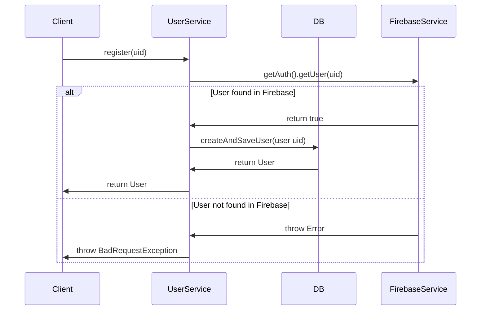
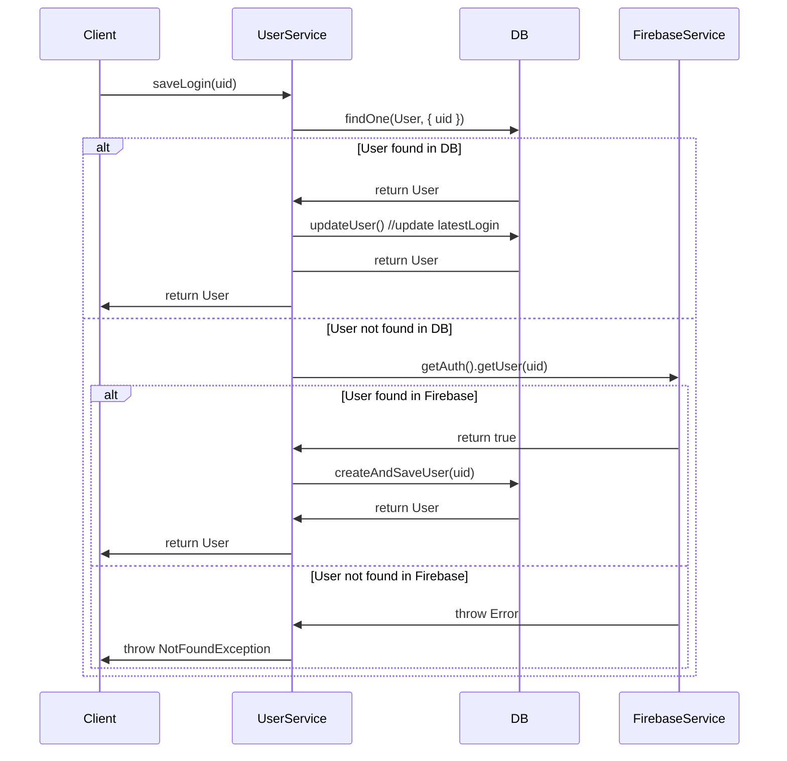

# Technical Interview - PERN Developer

## User Stories

**Note:** Leverage on Firebase Auth to achieve the following requirements using the mentioned tech stack.

- **As a Public User**
    - I want to be able to register myself via username and password
    - I expect that, upon successful creation, a local database should store a record referencing uid, latestLogin, and soft delete

- **As a Member**
    - I want to be able to authenticate myself via username and password to access the home screen

- **As a Public User**
    - I should be redirected from the home screen to the login screen when I am not authenticated

- **As a Public User and Member**
    - I want the portal to be mobile-responsive for easy viewing on my phone

## Bonus

Showcase your knowledge and capabilities by attempting the following bonus features:

- Use of containerization technology
- Coverage of as many alternate / exceptional flows as possible


# Submission for Backend
> To follow the best practice for CI/CD deployment, submission is separated between frontend and backend

> https://github.com/ikhsangama/linkz-backend

> https://github.com/ikhsangama/linkz-frontend

## Key Assumptions
- Authentication is fully handled by firebase, we want the system in high availability so that any exception when storing user `last login` activity in our backend will not interrupt the user experience.

## Out of Scope
1. **Advanced User Functionalities**: Any advanced functionalities for users beyond registration, login, and redirection, such as profile editing, inbox messaging, friendship systems, etc., could be considered out of scope as they're not mentioned in the project brief
2. **Third Party Services Integration**: Although Firebase Authentication is required, integrating more services such as Firebase Cloud Messaging or other third-party services might be considered out of scope unless explicitly requested.
3. **Advanced UI/UX Design**: While the project needs to be mobile responsive, detailed UI/UX design, animation, and complex interactivity may be outside the scope of this project.

## Sequence Diagram
### Register

### Login


# Run application
## Prerequisite
1. `node` - version 20
2. `docker` - for building docker images (can be installed with docker desktop).
3. `docker-compose` - for setting/spinning up dev https://docs.docker.com/compose/install/

## Running in docker
1. Build image and spin up docker container
    ```bash
    docker-compose up --build
    ```
2. Run the migration
   ```bash
   npx mikro-orm migration:up
   ```
